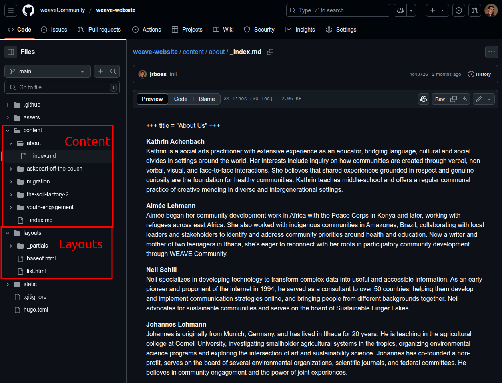
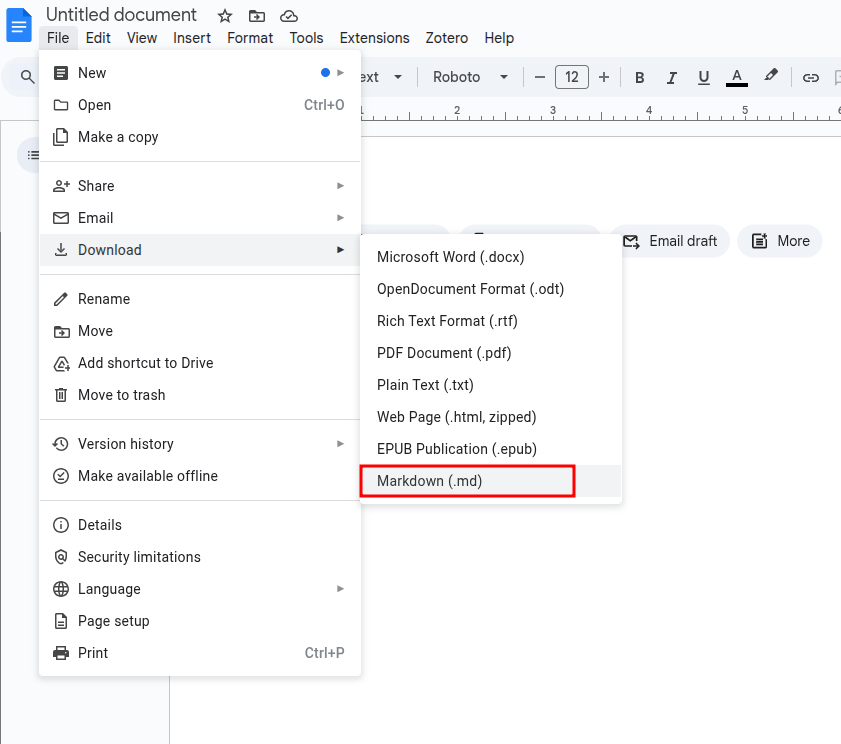
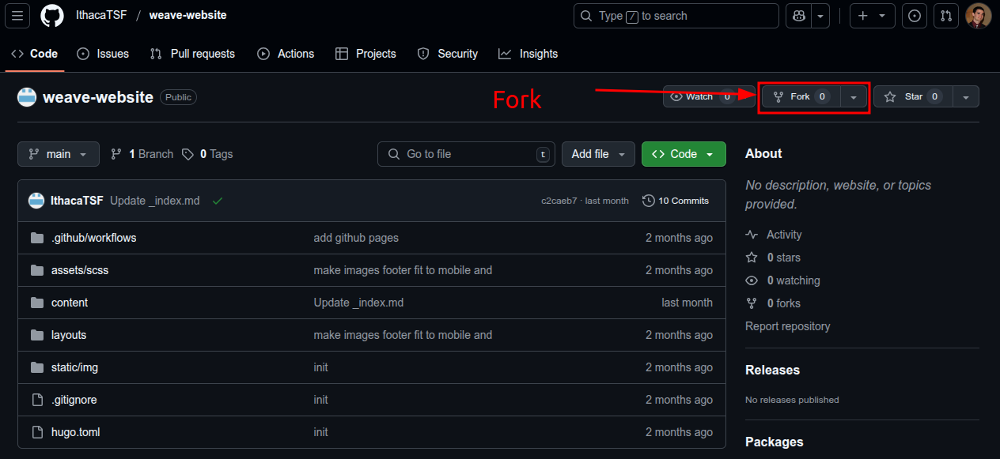
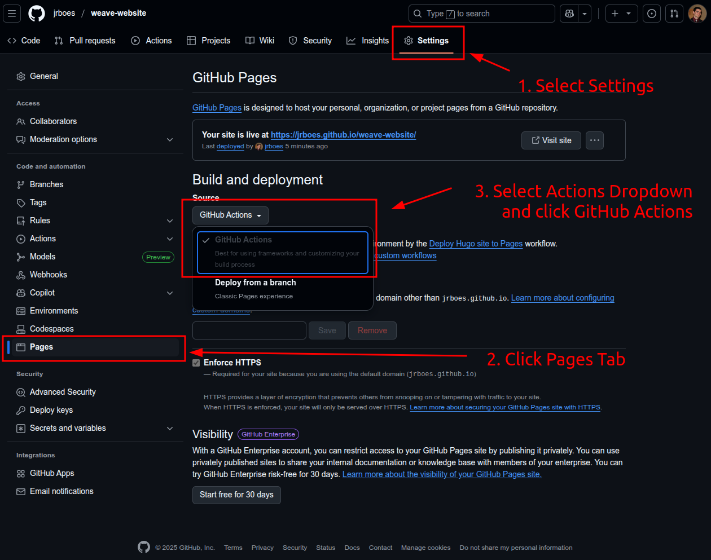
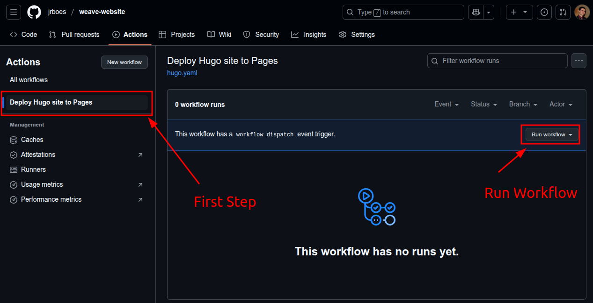
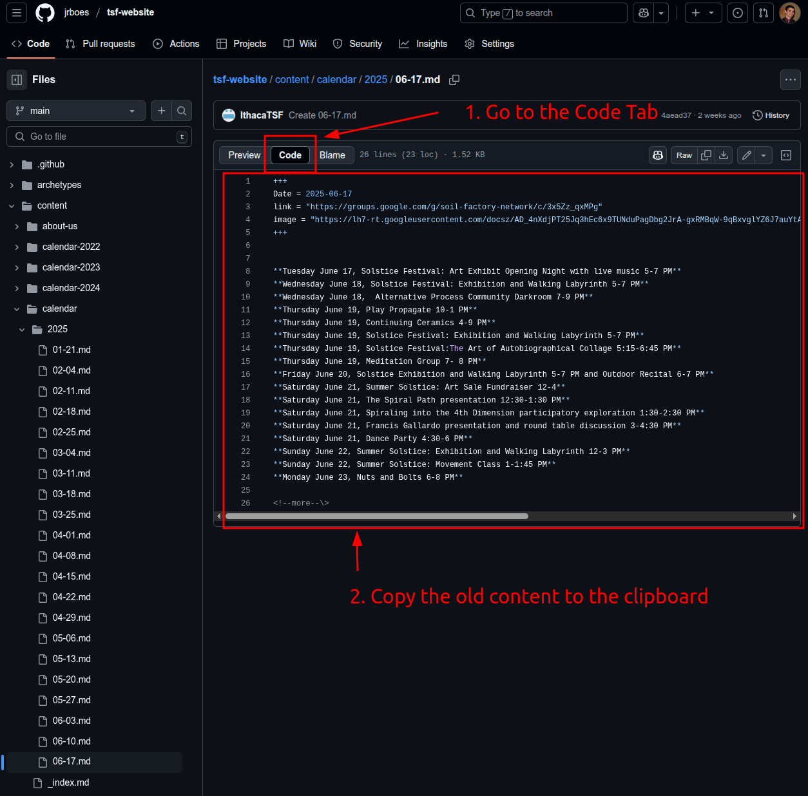
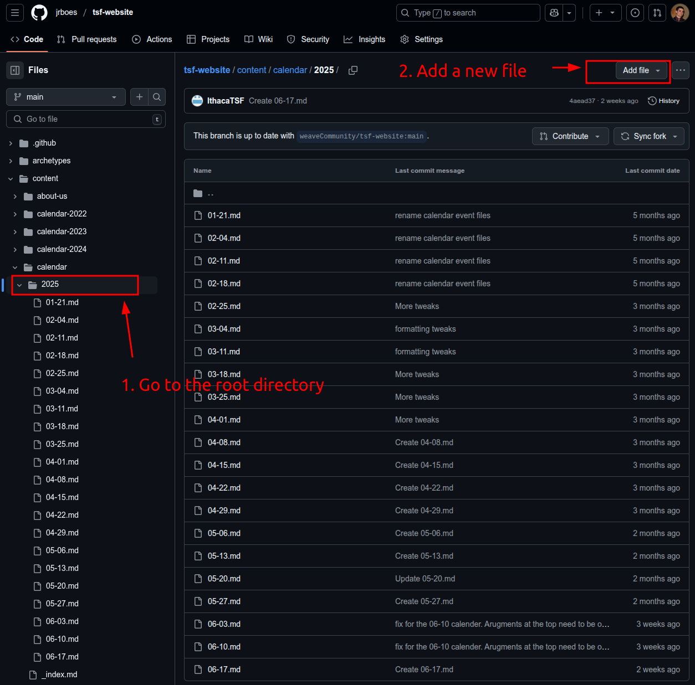
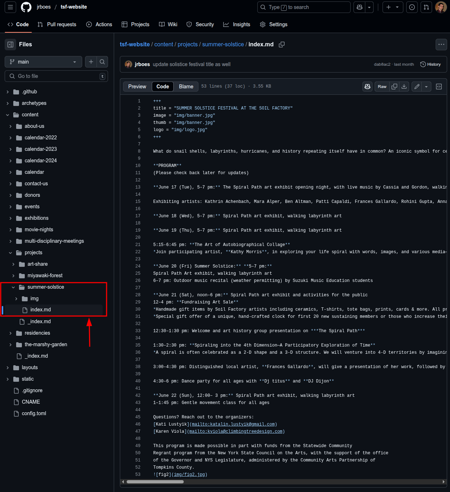

# Static Web Page Maintenance Tutorial

Author: Jacob Boes  
Date: 2025-07-01

## Outline
- Static page hosting on GitHub - How and Why
- Templating using Hugo - What the basic file structure means
- A brief introduction to Markdown Script
- Forking (Copying) your own repository
- How to update the calendar
- How to add a project page
- How to add an untempled page
- Using GitHub's version control as a tool for learning

## Static page hosting on GitHub - How and Why
Weave transitioned from a dynamic webpage engine ([WordPress](https://wordpress.com)) to a static page produced using the [HUGO](https://gohugo.io) templating framework and hosted on [GitHub Pages](https://pages.github.com).

The Soil Factory and Weave Community web pages are currently hosted [weaveCommunity GitHub Organization](https://github.com/weaveCommunity). [GitHub Organizations](https://docs.github.com/en/organizations/collaborating-with-groups-in-organizations/about-organizations) allow for management for GitHub repositories by multiple GitHub users at once. You can also host a page on a personal GitHub account, which you can sign up for [here](https://github.com/). We will be using both, so make sure you have your own account.

What is the difference between a static and dynamic web page and why do we use static?

### Static
Static pages are more light-weight and require fewer computational resources to implement. Because of this, services like GitHub Pages are offered for free to entire people to use their platform, on the condition that these website codes are left open source. This makes accessing all the code which produces the site the default, and thus easier to transfer to other platforms.

Templating frameworks like HUGO can further simplify the process of creating a static page, separating the content, in Markdown format, from the layout, in HTML, CSS, and Javascript. Even so, static pages lack a graphical user interfaces (GUI), which can increase the barrier to entry for getting started with one and are not suitable for all purposes, such as those that require user logins, however many dynamic features can now be embedded into static sites, such as Google Calender, which further mitigates the need for maintaining a dynamic page.

### Dynamic
Dynamic pages utilize a database of information to be able to respond dynamically to an individual user. Any Web page you've logged into with a user account is a dynamic page, which stores personal information about you which it can retrieve later. In spite of what dynamic web page services often suggest, this added complexity makes them much more difficult to maintain than a static pages, which is reflected in the cost. Dynamic web page service providers, like [Squarespace](https://www.squarespace.com), are also not under any obligation to make the data you provide them available to you again, which can make switching providers difficult.

Dynamic pages can be a more enticing choice because of their GUIs which make the barrier to entry much lower for basic webpage creation. But, making custom sites look good often still requires professional help or a considerable time commitment in the end.

## Templating using Hugo - What the basic file structure means

[HUGO](https://gohugo.io) is a templating tool for helping with static web page development. One of the primary functions for the purpose of beginners, is to separate `Content`
 from `Layouts`. Below is a screenshot of the folder structure of the Weave Community website hosted on GitHub.

The Content folder is highlighted and a markdown file named `_index.md` selected and displayed on the left. All content can be modified as plain text using markdown script, which is described in greater detail below.

The Layouts folder includes templates of HTML code along with variables which determine the position of the content. Designing a layout is beyond the scope of this tutorial, as that requires knowledge of HTML programming, but in the case of the Weave Community page, we can create an entirely new page without adding any additional layout information. This isn't the case for TSF website, since it is designed to retain as much of the old design as possible. This may be changed in the future to make updates as simple as possible.

For this tutorial, we'll be focusing on adding information to the web page through editing the content folder.

## A brief introduction to Markdown Script
This file is written in Markdown, and here's a blurb about it from [Markdown's website](https://www.markdownguide.org/getting-started).

> Markdown is a lightweight markup language that you can use to add formatting elements to plaintext text documents. Created by John Gruber in 2004, Markdown is now one of the world’s most popular markup languages.
> 
> Using Markdown is different than using a WYSIWYG editor. In an application like Microsoft Word, you click buttons to format words and phrases, and the changes are visible immediately. Markdown isn’t like that. When you create a Markdown-formatted file, you add Markdown syntax to the text to indicate which words and phrases should look different.

If you want to experiment with writing Markdown, [Dillinger](https://dillinger.io) is a helpful online Markdown tool which demos what all is possible. There are also many desktop tools available for rendering markdown in real time.

If you don't care for learning to write or format Markdown at all, you can also use [Google Docs](https://search.brave.com/search?q=Google+Docs), which is likely more familiar and can export to Markdown through the Download menu as shown below.

Similar to text documents ending in `.txt`, markdown files must end in `.md` to be recognized.

## Forking (Copying) your own repository

First, go to the weaveCommunity version of the web page you want to copy and select the fork button, shown in the image below.

Once the fork is done, we have a copy of the website on our own personal GitHub account. This will allow us to play around with the look of the page as much as we want without worrying about damaging the live page. Very useful for learning, experimenting, or creating mockups for others.

Before we can visualize our copy of the website, we need to enable the GitHub Pages feature for our newly forked repo. We start by first going to: 1) Settings, then 2) Pages, then selecting GitHub actions under the dropdown as shown in the image below.

Finally, we go to the Actions tab at the top of the screen, select the `Deploy Hugo site to Pages` action and then run the workflow as shown in the image below:

Congratulations! You're now hosting your very own web page which happens to be an exact duplicate of the original! Three cheers for open source code!

## How to update the calendar

The `Calender` folder on TSF's web page is set up as what HUGO calls a `lists` page (as opposed to a `single` page). This means it's designed to showcase a list of other pages, and each of the weekly update lists is configured as its own page.

To make a new listing show up at the top of the calendar section, we simply need to add a new "page". There's more than one way to do this, the images below outline only one.

First, go to an existing page entry under the calendar folder in `content`, than select the `Code` tab as shown in the image below and copy the content displayed on te screen to your clipboard.

Next, navigate to the root directory, and create a new file as shown in the steps below.

Then, you can assign a name to the new file at the top. The name doesn't matter so much except that the file must be markdown, i.e. ends in `.md`. Then you can copy the content of the old file into this one and begin updating the markdown via your preferred method.

The Arguments at the top are critical to get right for proper function. The first is the start date of the week we are adding. The `link` argument is a link to the newsletter, and the `image` argument is a link to an image for the thumbnail shown on the web page, usually one of the images in the newsletter.

## How to add a project page

Project pages are also pre-templated in the `layouts` folder so once again, we can get everything done with markdown in the `content` folder. Some of the pages utilize some advanced features, which allow for images to alternate sides of the page. We'll be leaving that for later and looking at the Summer Solstice page for now, which is simpler.

The first thing to know is the structure of the page. The image below outlines the necessary structure for creating a new project page. We need a new folder in the `content/projects` directory, and it must contain a `index.md` file. This is the main content file for a page. The `img` directory contains any static images shown on the page. This isn't strictly necessary since images can be hosted elsewhere and linked to, like in the case of the thumbnail images we use for the calendar.

Again, the `index.md` file has arguments at the top which mean the following:

- `title`: The title of the project, added to the header of the page and also on the thumbnail images on the list page.
- `image`: The banner image at the top of the page. This image should have banner dimensions, and is 1320 pixels wide at its maximum.
- `thumb`: The thumbnail image shown on the list projects page. It is 720 pixels wide at its maximum.
- `logo`: An optional logo image displayed in the top right of the projects main page below the banner. It is 300 pixels wide at its maximum.
- `summary`: An optional summary string for the list projects page. If not used, the summary will be taken from the first 300 characters of the main page content.

Make sure each of these arguments is on its own line, along with the `+++` symbols as well.  The rest of the content is simply markdown, which you can modify in real time using the tools above.

## How to add an untempled page

**Work in Progress - See section below**

## Using GitHub's version control as a tool for learning

Recently, we created a new TSF Donor page and added it to the navigation bar. This was not a previously templated page design, and since the TSF website is designed first and foremost around preserving as much of the olf aesthetic as possible, this was not possible without adding HTML code to the `layouts` folder. The Weave Community web page is designed differently, so there are default templates for all pages at the cost of a more generic looking page as I didn't have time to add many features and details. You can compare the `layouts` folder across the two pages to see what I mean.

Going into detail about HTML coding is beyond the scope of this tutorial, but one of the beautiful things about hosting code on GitHub is the version control feature it's originally designed for. Hopefully, by now you're becoming somewhat comfortable with the idea that our HUGO web page is just a folder structure, with the main components being housed in either the `content` or the `layouts` folders.

By looking at a commit I made for publishing the Donors page on TSF's web page, we can see all of what files were changed/added to make the Donor page: [here](https://github.com/weaveCommunity/tsf-website/commit/6634cc5f5211e4d5afe3fda2a26e7c6bba7ad193). These changes revolve around 3 files, the first being a `_index.md` file being added under a directory in `content/donors`. Here, since the donor page isn't a sub-page like the calendar entries or project pages, we use a `_index.md` file instead of a `index.md` file. The direcotry page `donors` is also important, since it needs to match in the `layouts` directory.

The second addition, is the `layouts/donors/list.html` file, which contains HTML and Hugo templating code. This code is messy, due to the requirements mentioned above. Hopefully some day we can overhaul the look of the page to make this easier. This is less of a problem when the only one managing pages is a professional.

The 3rd and final change is in the `config.toml` file where an entry was added to the main menu, letting Hugo know to add the Donor page to the navigation menu.